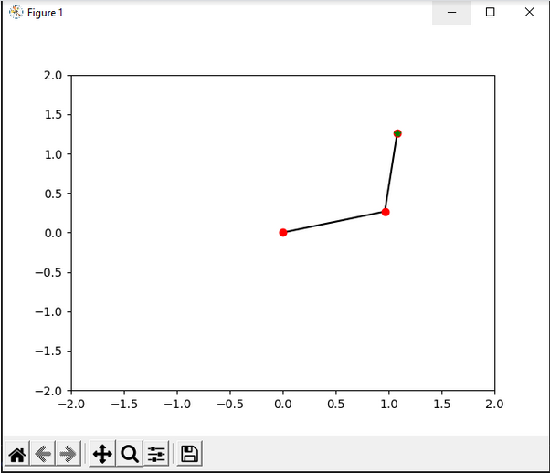
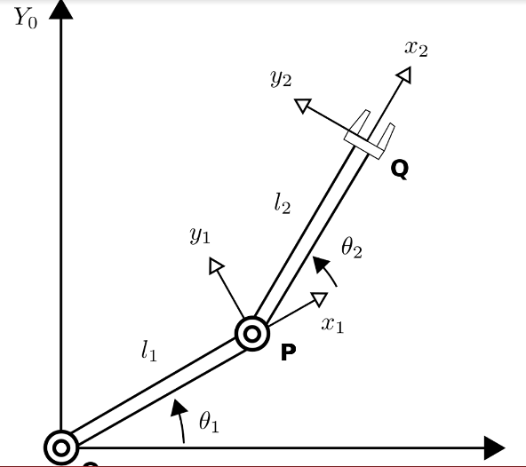

# robotic_project

This is a Simulation of a manipulator arm with two degrees of freedom .

# Introduction

Les bras robotiques sont employés depuis plusieurs années déjà dans le domaine industriel. Ces outils permettent de faciliter les opérations de fabrication et en particulier d’automatiser efficacement le travail à la chaîne souvent pénible et potentiellement dangereux pour des humains.

Afin de remplir leurs rôles et fonctions du mieux possible, les bras manipulateurs possèdent plusieurs degrés de libertés. Un degré de liberté est une notion qui va permettre de caractériser les mouvements du robot, cela correspond notamment à une translation ou encore à une rotation autour d’un axe défini. Les déplacements et mouvements de ce genre de robot sont donc forcément conditionnés par les degrés de liberté qu’il possède ainsi que par les caractéristiques géométriques des pièces qui le composent.

Le but de ce projet est de nous permettre, dans un premier temps, d’émuler les déplacements d’un tel robot afin de mieux en comprendre les propriétés. Ensuite, nous devrons mettre en œuvre une solution reposant sur un réseau de neurone convolutif afin de permettre au robot d’atteindre une position définie par l’opérateur qui le contrôle. L’opérateur n’aura qu'à entrer les coordonnées du point visé, lancer l'entraînement du robot et celui devrait ensuite être en mesure de rejoindre ce point par lui-même.

# Choix des outils et description de la méthode

    Afin de réaliser ce projet, plusieurs choix se présentaient à nous. Dans un premier temps, il nous fallait définir un simulateur. Pour cela, nous avions la possibilité de reprendre un robot déjà existant en utilisant le simulateur de robotique précédemment utilisé lors de ce cours : Vrep. Une autre possibilité était de créer nous même un programme simple permettant de représenter le robot sur un graphique en deux dimensions.

    Puisque les scripts permettant d’employer un robot sur Vrep et le code faisant appel au réseau de neurones étaient écrit sous Python, nous avons décidé de mettre en place notre propre solution de simulation. La librairie Python nous permettant d'accéder facilement à l'outil matplotlib que nous connaissions déjà nous avons supposé que cela ne poserait pas de problème. Qui plus est, employer le simulateur Vrep nous impose de travailler dans un environnement alors que le robot en question ne possède que deux degrés de liberté. Il aurait donc fallu utiliser un robot déjà existant dans le simulateur, en bloquer l’un des axes et ensuite travailler à partir de ce modèle. Bien que cela ne présentait à priori pas de problème, utiliser Vrep nous aurait imposé des contraintes supplémentaires alors que notre connaissance en Python nous permettrait de surpasser facilement ces problèmes.

Figure 1 : Afin de représenter notre robot, nous somme partie de ce modèle, il fait appel à la librairie Matplotlib de Python.

# Etablissement du modèle géométrique et calcul du gradient

    Le robot que nous allons modéliser est considéré comme étant composé de deux bras, l’un de longueur L1, l’autre de longueur L2. Le système à deux degré de liberté peut être décrit schématiquement par la figure 2:

Figure 2 : représentation schématique de la modélisation de notre système à deux degrés de liberté.

    L’objectif de l’utilisation d’un réseau de neurones est donc de minimiser, le plus possible, la distance entre le point Q du robot et la cible définie par l’utilisateur. Autrement dit, on espère minimiser les erreurs en X et en Y au point Q. Les coordonnées de ce point sont en effet, à l’instant t :

Xp(t) = L1 _cos(Θ1) + L2 _ cos(Θ1 + Θ2)
Yp(t) = L1 _ sin(Θ1) + L2 _ sin(Θ1 + Θ2)

Afin de parvenir à toucher la cible, il faut pouvoir calculer la position du point Q à l’instant t + Δt. Ce qui s’obtient de la façon suivante :

Xp(t + 1) = Xp(t) + Δt _ Xp(t)
Yp(t + 1) = Yp(t) + Δt _ Yp(t)
Dans l’optique de parvenir au résultat, et donc de programmer correctement le réseau de neurones, nous allons donc calculer le gradient, en commençant par obtenir la matrice jacobienne du système.

dXp(t))/dq1 = - L1 _ sin(Θ1) - L2 _ sin(Θ1 + Θ2)
dXp(t))/dq2 = - L2 \* sin(Θ1 + Θ2)

dYp(t ))/dq1 = L1 _ cos(Θ1) + L2 _ cos(Θ1 + Θ2)
dYp(t))/dq2 = L2 \* cos(Θ1 + Θ2)

En effet , l’objectif est de minimiser l’erreur J=ἐx2- ἐy2
= (Xc - Xp(t+1))2 - (Yc - Yp(t+1))2
= (Xp (t+1) - XC) 2 - (Yc - Yp(t+1))2
dJ(t + 1))/dq(t) = 2* (Xp(t+1)-Xc) * dἐX/dq(t) + 2* (Yc - Yp(t+1)) * dἐY/dq(t)

avec :

dἐX/dq(t) = Δt _ dXp(t))/dq(t) et dἐY/dq(t) = Δt _ dYp(t))/dq(t)

Enfin ,on trouve, suite au calcul de la méthode directe MCD :

-2Δt _ [Xp(t + Δt) - Xc] _ (L1 _ sin(Θ1) + L2 _ sin(Θ1 + Θ2)
-2Δt _ [Xp(t + Δt) - Xc] _ (L2 _ sin(Θ1 + Θ2))
2Δt _ [Yp(t + Δt) - Yc] _ (L1 _ cos(Θ1) + L2 _ cos(Θ1 + Θ2))
2Δt _ [Yp(t + Δt) - Yc] _ (L2 _ cos(Θ1 + Θ2))

On peut alors obtenir une formule satisfaisante du gradient à partir de celle de la matrice jacobienne obtenue juste au-dessus.

Xp(t) = -2Δt _ [Xp(t + Δt) - Xc] _ (L1 _ sin(Θ1) + L2 _ sin(Θ1 + Θ2) + 2Δt _ [Yp(t + 1) - Yc] _ (L1 _ cos(Θ1) + L2 _ cos(Θ1 + Θ2))

Yp(t) = -2Δt _ [Xp(t + 1) - Xc] _ (L2 _ sin(Θ1 + Θ2)) + 2Δt _ [Yp(t + 1) - Yc] _ (L2 _ cos(Θ1 + Θ2))

Le gradient obtenu va ensuite être indispensable dans la programmation du perceptron multicouche puisqu’il va jouer un rôle majeur dans le bon déroulement de l’algorithme de rétropropagation du gradient. Cet algorithme va entrer en jeu de sorte à modifier les poids qui composent les différentes couches du réseau de neurone, lui permettant donc de s'entraîner avec succès et de toucher la cible avec une bonne précision.

# Description et fonctionnement du code

    Notre code python est composé de quatre programmes distincts : main.py, backpropagation.py, online_trainer.py et simulation.py.

    Le programme simulation.py contient une classe robot manipulateur, dont les différentes méthodes ont pour but de réaliser la simulation graphique du robot dans une fenêtre Matplotlib. La classe possède en particulier plusieurs méthodes permettant d'accéder aux données géométriques du robot.

    Le programme backpropagation.py permet de mettre en place une classe réseau de neurones. En particulier, cette classe est le fondement du perceptron multicouche employé par notre simulateur pour pouvoir toucher la cible grâce à un entraînement par intelligence artificielle.

    Le programme online_trainer.py est un code faisant le lien entre les deux programmes évoqués précédemment. En effet c’est ce code qui réalise l'entraînement, mais pour cela il a besoin d’un robot issu de la classe robot manipulateur et d’un réseau de neurones issu de la classe NN. Une fois le réseau entraîné à partir des données géométriques du robot, il retourne les résultats à main.py.

    Ce dernier programme peut alors être facilement lancé par l’utilisateur, lui permettant d’accéder à la simulation. En particulier, il permet de rentrer des coordonnées, de vérifier que celles-ci sont valides, et ensuite le programme va faire appel à tous les éléments nommés précédemment afin de réaliser l'entraînement du réseau puis l’affichage graphique de la simulation.

# Démonstration et analyse des résultats

    Les différentes démonstrations sont en annexes, ce sont des vidéos qui montrent le fonctionnement du programme. Lorsque l’on lance ce programme, celui-ci demande à l’utilisateur de lui fournir deux nombres. Ceux-ci correspondent alors au coordonnées de la cible choisie par l’utilisateur.

    Une fois ces coordonnées renseignées, le programme va faire appel au réseau de neurones pour pouvoir calculer en temps réel un chemin vers la cible, l’objectif étant de minimiser la fonction de coût et donc la distance entre le robot et la cible. Une fois les calculs effectués, la simulation se lance, on voit alors, grâce à Matplotlib, le cheminement du robot jusqu’à sa cible. Le chemin n’est clairement pas le plus direct, cela tient en effet compte du temps d’adaptation du programme et des calculs effectués lors de la mise en œuvre de la rétropropagation du gradient.

    Néanmoins, il arrive cependant que le programme ne parvienne pas à trouver un chemin vers sa cible. Parfois, le réseau de neurones échoue, ce qui résulte en des trajectoires très inadéquates dans certaines des simulations que nous avons mises en œuvre. La précision n’est donc pas parfaite et bien que la simulation semble en général capable d’atteindre la cible prédéfinie, cela reste un point qui pourrait être amélioré.

    Un autre point important est que nous avons finalement eu parfois du mal à utiliser la librairie python Matplotlib. En effet, la fonction supposée faire fonctionner les animations des figures nous rendait des résultats fixés, il n’y avait pas de mouvement. En conséquence, la première version de notre simulateur ne permettait que de prendre une capture d’écran du résultat. Heureusement, en nous inspirant de fonctionnalités déjà réalisées par d’autres programmeurs, nous avons pu réaliser un simulateur fonctionnel et mettant en œuvre des simulations.

    Enfin, il est à noter que, afin d’éviter des résultats aberrants, nous avons décidé d'empêcher l’utilisateur de rentrer une cible qu’il serait impossible de rejoindre pour le robot. Un simple test d’assertion lors de la saisie de la target permet en effet de s’assurer que les coordonnées sont atteignables. Dans le cas inverse, le simulateur lève une exception et empêche l’utilisateur d’aller plus loin.

# Conclusion

    Un robot ayant deux degrés de liberté semble en apparence très simple à utiliser et à modéliser. Mais lorsque l’on essaye de le commander à partir d’une intelligence artificielle, il faut prendre en compte plusieurs contraintes.

    La réalisation de ce projet reste cependant très formative, en partant d’un modèle de robot relativement simple, et en appliquant les directives du cours, nous avons pu mieux comprendre le fonctionnement d’un robot. En particulier, nous avons pu observer directement l’utilité d’implémenter une intelligence artificielle pour commander un automate de ce genre. La complexité d’utilisation d’un réseau de neurones convolutifs rendant la tâche moins aisée qu’il n’y paraît.

    Qui plus est, la décision de créer nous même un simulateur pour notre modèle plutôt que d’employer celui déjà existant (Vrep) nous a également permis d’aborder un domaine de l’informatique différent et surtout de nous améliorer dans la compréhension de la librairie Matplotlib de Python.
